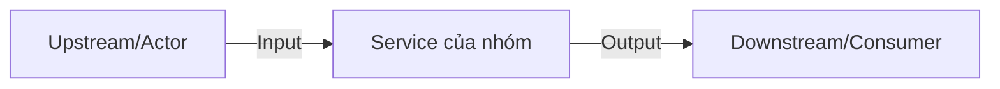

# Service Boundary

## 1. Tên Service

## 2. Bài toán Service giải quyết

## 3. Actor

## 4. Responsibility

## 5. Out of scope

## 6. Input

| Field | Type | Required | Ý nghĩa |
|---|---|---|---|

## 7. Output

## 8. Provider / Consumer

## 9. Upstream / Downstream

## 10. API dự kiến

## 11. Event dự kiến

## 12. Boundary Diagram

## 13. Vấn đề cần đàm phán ở Buổi 2
1.
2.
3.
