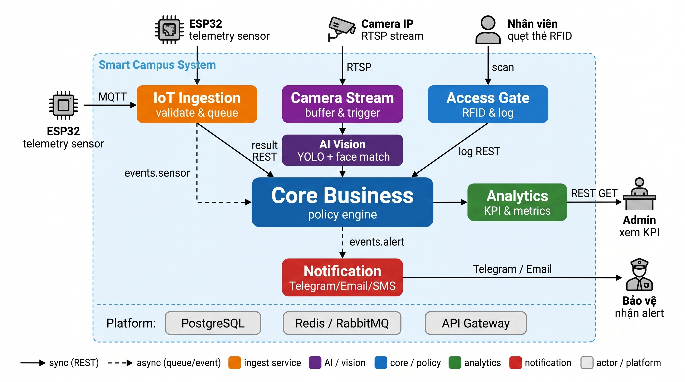

# Service Boundary

## 1. Tên Service

**Core Business Service**

## 2. Bài toán Service giải quyết

Core Business Service là service trung tâm xử lý luật nghiệp vụ (business rules) trong hệ thống **Smart Campus Operations Platform**. Service này tiếp nhận dữ liệu từ nhiều nguồn (IoT, Access Gate, AI Vision), áp dụng các rule/policy để đánh giá tình huống, quyết định khi nào một sự kiện là **bình thường** hay **bất thường**, và tạo **cảnh báo (alert)** khi cần thiết.

Các câu hỏi nghiệp vụ mà service cần trả lời:

- Nhiệt độ, độ ẩm, chuyển động có vượt ngưỡng cho phép không?
- Có người lạ xuất hiện trong khu vực cấm không?
- Có lượt ra/vào bất thường (ngoài giờ, quá nhiều lần) không?
- Khi có sự kiện bất thường, hệ thống có gửi thông báo kịp thời không?

## 3. Actor

| Actor              | Mô tả                                                                 |
|--------------------|------------------------------------------------------------------------|
| IoT Ingestion      | Gửi dữ liệu cảm biến (nhiệt độ, độ ẩm, chuyển động) đến Core.       |
| Access Gate        | Gửi sự kiện quẹt thẻ ra/vào để Core kiểm tra quyền và chính sách.    |
| AI Vision          | Gửi kết quả phân tích hình ảnh (phát hiện người, vật thể) đến Core.   |
| Admin / Operator   | Người quản trị cấu hình rule, xem danh sách alert, quản lý policy.    |

## 4. Responsibility

- Tiếp nhận dữ liệu sự kiện từ IoT Ingestion, Access Gate và AI Vision.
- Áp dụng rule/policy nghiệp vụ để đánh giá sự kiện (bình thường hay bất thường).
- Tạo alert khi phát hiện tình huống bất thường (vượt ngưỡng, truy cập trái phép, phát hiện người lạ).
- Gửi alert sang Notification Service để thông báo đến người phụ trách.
- Cung cấp dữ liệu quyết định và cảnh báo cho Analytics Service.
- Quản lý danh sách rule/policy (CRUD).
- Ghi log toàn bộ sự kiện và quyết định xử lý.

## 5. Out of scope

- **Không** thu thập dữ liệu trực tiếp từ thiết bị vật lý (sensor, camera, RFID reader).
- **Không** chạy mô hình AI/ML để phân tích hình ảnh.
- **Không** gửi thông báo trực tiếp đến người dùng cuối (Telegram, Email, SMS...).
- **Không** tổng hợp metric hoặc tạo báo cáo thống kê (thuộc Analytics).
- **Không** quản lý danh sách thiết bị IoT, camera hay cổng ra/vào.
- **Không** xây dựng giao diện dashboard phức tạp (front-end chỉ ở mức tối thiểu).

## 6. Input

### 6.1 Dữ liệu cảm biến từ IoT Ingestion

| Field       | Type    | Required | Ý nghĩa                          |
|-------------|---------|----------|-----------------------------------|
| device_id   | string  | ✅       | Mã định danh thiết bị IoT        |
| temperature | float   | ❌       | Nhiệt độ đo được (°C)            |
| humidity    | float   | ❌       | Độ ẩm đo được (%)                |
| motion      | boolean | ❌       | Có phát hiện chuyển động không    |
| timestamp   | string  | ✅       | Thời điểm ghi nhận (ISO 8601)    |

### 6.2 Sự kiện ra/vào từ Access Gate

| Field      | Type   | Required | Ý nghĩa                              |
|------------|--------|----------|---------------------------------------|
| card_id    | string | ✅       | Mã thẻ RFID / mã sinh viên           |
| gate_id    | string | ✅       | Mã cổng ra/vào                       |
| direction  | string | ✅       | Chiều di chuyển: `IN` hoặc `OUT`     |
| person_id  | string | ❌       | Mã người dùng (nếu đã định danh)     |
| timestamp  | string | ✅       | Thời điểm quẹt thẻ (ISO 8601)        |

### 6.3 Kết quả phân tích từ AI Vision

| Field       | Type   | Required | Ý nghĩa                                |
|-------------|--------|----------|-----------------------------------------|
| camera_id   | string | ✅       | Mã camera gửi ảnh                      |
| detected    | boolean| ✅       | Có phát hiện đối tượng không            |
| object      | string | ❌       | Loại đối tượng phát hiện (person, ...)  |
| confidence  | float  | ❌       | Độ tin cậy của kết quả (0.0 – 1.0)     |
| risk_level  | string | ❌       | Mức rủi ro: `low`, `medium`, `high`    |
| timestamp   | string | ✅       | Thời điểm phân tích (ISO 8601)          |

## 7. Output

### 7.1 Alert (Cảnh báo)

```json
{
  "alert_id": "ALT-001",
  "type": "unauthorized_access",
  "severity": "high",
  "source_service": "access_gate",
  "message": "Access attempt outside allowed time",
  "rule_id": "RULE-003",
  "timestamp": "2026-05-02T22:15:00",
  "metadata": {
    "card_id": "RFID-2026-001",
    "gate_id": "gate-main"
  }
}
```

### 7.2 Event evaluation result

```json
{
  "event_id": "EVT-100",
  "status": "normal | abnormal",
  "matched_rules": ["RULE-001"],
  "alert_created": false
}
```

## 8. Provider / Consumer

| Vai trò    | Service             | Mô tả                                              |
|------------|---------------------|-----------------------------------------------------|
| Provider   | IoT Ingestion       | Cung cấp dữ liệu cảm biến cho Core xử lý.         |
| Provider   | Access Gate         | Cung cấp sự kiện quẹt thẻ ra/vào cho Core.          |
| Provider   | AI Vision           | Cung cấp kết quả nhận diện hình ảnh cho Core.       |
| Consumer   | Notification        | Nhận alert từ Core để gửi thông báo đa kênh.        |
| Consumer   | Analytics           | Nhận dữ liệu quyết định/cảnh báo từ Core để thống kê.|

## 9. Upstream / Downstream

```
Upstream (gửi dữ liệu đến Core):
  ├── IoT Ingestion Service
  ├── Access Gate Service
  └── AI Vision Service

Downstream (nhận dữ liệu từ Core):
  ├── Notification Service
  └── Analytics Service
```

## 10. API dự kiến

| Method | Endpoint                     | Mô tả                                      |
|--------|------------------------------|---------------------------------------------|
| POST   | `/api/v1/events/iot`         | Nhận sự kiện cảm biến từ IoT Ingestion.     |
| POST   | `/api/v1/events/access`      | Nhận sự kiện ra/vào từ Access Gate.          |
| POST   | `/api/v1/events/vision`      | Nhận kết quả phân tích từ AI Vision.         |
| GET    | `/api/v1/alerts`             | Lấy danh sách alert (có filter, phân trang). |
| GET    | `/api/v1/alerts/{alert_id}`  | Lấy chi tiết một alert.                     |
| PUT    | `/api/v1/alerts/{alert_id}`  | Cập nhật trạng thái alert (acknowledged...). |
| GET    | `/api/v1/rules`              | Lấy danh sách rule/policy.                  |
| POST   | `/api/v1/rules`              | Tạo rule mới.                               |
| PUT    | `/api/v1/rules/{rule_id}`    | Cập nhật rule.                               |
| DELETE | `/api/v1/rules/{rule_id}`    | Xóa rule.                                   |
| GET    | `/api/v1/health`             | Health check endpoint.                       |

## 11. Event dự kiến

| Event Name              | Trigger                                     | Gửi đến          |
|--------------------------|----------------------------------------------|-------------------|
| `alert.created`          | Khi một rule match và tạo alert mới.         | Notification      |
| `alert.updated`          | Khi trạng thái alert thay đổi.               | Analytics         |
| `event.evaluated`        | Khi một sự kiện đầu vào được đánh giá xong.  | Analytics         |
| `rule.threshold_breach`  | Khi giá trị cảm biến vượt ngưỡng rule.       | Notification      |

## 12. Boundary Diagram



## 13. Vấn đề cần đàm phán ở Buổi 2

1. **Thống nhất format dữ liệu đầu vào** với nhóm IoT Ingestion, Access Gate và AI Vision (field name, data type, required/optional).
2. **Thống nhất format alert gửi sang Notification** (cấu trúc JSON, severity levels, target channel).
3. **Thống nhất cách Analytics lấy dữ liệu từ Core** (Core push event hay Analytics poll API, tần suất cập nhật).
