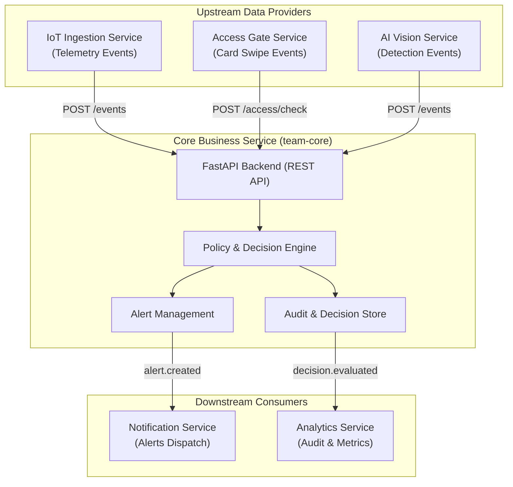

# Smart Campus Operations Platform — Core Business Service

**Học phần:** FIT4110 – Dịch vụ kết nối và Công nghệ nền tảng  
**Dự án Case Study:** Smart Campus Operations Platform  
**Phân hệ đảm nhiệm:** **Core Business Service** (`team-core`)  
**Repository:** [tyanzuq2811/Core_Business_Service](https://github.com/tyanzuq2811/Core_Business_Service.git)  

---

## 👥 Bảng Phân Chia Công Việc & Tỷ Lệ Đóng Góp Nhóm (Lab 02 – Lab 05)

| STT | Mã Sinh Viên | Họ và Tên | Lớp | Tỷ Lệ Thực Hiện |
| :---: | :---: | :---| :---: | :---: |
| **1** | **1771020189** | **Lê Tuấn Dũng** *(Trưởng nhóm)* | **KHMT 17-01** | **40%** |
| **2** | 1771040024 | Nguyễn Duy Thuận | KHMT 17-01 | 20% |
| **3** | 1771040025 | Nguyễn Văn Tiến | KHMT 17-01 | 20% |
| **4** | 1771040011 | Bế Quang Hải | KHMT 17-01 | 20% |

---

## 1. Giới thiệu Tổng quan về Core Business Service

**Core Business Service** đóng vai trò là "bộ não" trung tâm điều phối nghiệp vụ và thực thi chính sách (Policy Engine) trong hệ sinh thái **Smart Campus Operations Platform**. 

Service có nhiệm vụ:
- **Tiếp nhận sự kiện** từ các phân hệ thu thập dữ liệu: Dữ liệu cảm biến môi trường (**IoT Ingestion**), sự kiện quẹt thẻ kiểm soát ra/vào cổng (**Access Gate**), và kết quả nhận diện thị giác máy tính (**AI Vision**).
- **Đánh giá và thực thi chính sách**: Kiểm tra tính hợp lệ của lượt ra/vào theo thời gian thực (định dạng thẻ `RFID-YYYY-NNN`, hướng `IN`/`OUT`, chống trùng lặp giao dịch `IdempotencyKey`).
- **Phát sinh & Quản lý Cảnh báo (Alerts)**: Tự động tạo cảnh báo khi phát hiện bất thường (truy cập trái phép, nhiệt độ vượt ngưỡng) và chuyển tiếp tới **Notification Service**.
- **Lưu vết Kiểm toán (Audit & Decision Trail)**: Ghi nhận lịch sử quyết định để cung cấp dữ liệu phục vụ thống kê cho **Analytics Service**.



---

## 2. Cấu trúc Repository & Quá trình Phát triển qua các Lab

Toàn bộ quá trình nghiên cứu, thiết kế hợp đồng, kiểm thử và đóng gói **Core Business Service** được phân bổ theo từng thư mục lab tương ứng:

```text
Core_Business_Service/
├── README.md                                    # [Tài liệu này] Tổng quan toàn bộ Service
│
├── FIT4110_Buoi01_Setup_ServiceBoundary/        # LAB 01: Thiết lập & Ranh giới Dịch vụ
│   ├── README.md                                # Hướng dẫn & tổng quan Buổi 1
│   ├── docs/service-boundary-guide.md           # Hướng dẫn xác định Service Boundary
│   ├── evidence/buoi-01/service-boundary.md     # Ranh giới nghiệp vụ chi tiết của Core Business
│   └── scripts/smoke_test.sh                    # Scripts smoke test môi trường ban đầu
│
├── FIT4110_lab02_openapi-main/                  # LAB 02: Thiết kế Hợp đồng OpenAPI 3.1.0
│   ├── README.md                                # Hướng dẫn thiết kế hợp đồng API
│   ├── campus-spectral.yaml                     # Bộ quy chuẩn kiểm tra hợp đồng Smart Campus
│   ├── docs/event-contract-*.md                 # Hợp đồng sự kiện với các bên liên quan
│   └── user-stories/                            # User stories và kịch bản đàm phán hợp đồng
│
├── FIT4110_lab03_postman_mock_testing-main/     # LAB 03: Postman, Mock Server & Newman CI
│   ├── README.md                                # Hướng dẫn thiết lập Mock và Test Suite
│   ├── contracts/core-business.openapi.yaml     # Hợp đồng OpenAPI hoàn chỉnh
│   ├── postman/collections/                     # Postman Test Collection (24 requests)
│   ├── postman/environments/                    # Postman Environments (Mock & Local)
│   └── reports/                                 # Báo cáo kết quả kiểm thử tự động
│
├── FIT4110_lab04_docker_packaging-main/         # LAB 04: Đóng gói Docker & Runtime Container
│   ├── Dockerfile                               # Multi-stage Dockerfile (Non-root, Healthcheck)
│   ├── .dockerignore                            # Tối ưu hóa build context
│   ├── .env.example                             # Cấu hình biến môi trường an toàn
│   ├── .spectral.yaml                           # Bộ quy chuẩn Spectral OAS 3.1
│   ├── Makefile                                 # Phím tắt thao tác nhanh
│   ├── RUN_LOCAL.md                             # Hướng dẫn chi tiết chạy cục bộ cho máy khác
│   ├── README.md                                # Tài liệu chi tiết Lab 04
│   ├── contracts/core-business.openapi.yaml     # Hợp đồng OpenAPI của Core Business
│   ├── src/core_app/main.py                     # Triển khai backend FastAPI đầy đủ
│   ├── postman/                                 # Bộ kiểm thử Postman/Newman trên Container
│   └── reports/                                 # Báo cáo JUnit XML & HTML Extra
│
└── FIT4110_lab05_docker_compose-main/          # LAB 05: Đa dịch vụ Docker Compose & Plug-a-thon
    ├── docker-compose.yml                       # Cấu hình Docker Compose đa container
    ├── RUN_COMPOSE.md                           # Hướng dẫn chạy đa dịch vụ
    └── README.md                                # Tài liệu Lab 05
```

### Tóm tắt tiến trình qua từng giai đoạn:

| Lab | Trọng tâm công việc của Core Business Service | Kết quả bàn giao chính |
|---|---|---|
| **Lab 01** | Xác định phạm vi trách nhiệm (In-scope/Out-of-scope), Actor, luồng dữ liệu Input/Output, Upstream/Downstream. | [service-boundary.md](file:///d:/Service/FIT4110_Buoi01_Setup_ServiceBoundary/evidence/buoi-01/service-boundary.md) |
| **Lab 02** | Chuẩn hóa API Contract theo chuẩn OpenAPI 3.1.0, định nghĩa mã lỗi RFC 9457 `ProblemDetails`, cơ chế Bearer Auth. | `core-business.openapi.yaml`, đàm phán hợp đồng đa bên |
| **Lab 03** | Xây dựng Prism Mock Server, thiết kế 24 kịch bản kiểm thử Postman bao phủ Functional, Auth, Negative, Boundary, SLA. | Postman Collection, Newman CI Reports (XML/HTML) |
| **Lab 04** | Triển khai mã nguồn FastAPI thực tế, đóng gói Multi-stage Dockerfile, chạy non-root `appuser`, native healthcheck, 100% không hardcode. | Container `fit4110/core-business:lab04`, 100% Test Pass |
| **Lab 05** | Tích hợp mạng lưới đa dịch vụ qua Docker Compose & Plug-a-thon toàn trường. | `docker-compose.yml`, kiểm thử tích hợp liên phân hệ |

---

## 3. Danh mục API của Core Business Service

| Method | Endpoint | Mô tả Nghiệp vụ | Mã phản hồi |
|---|---|---|---|
| `GET` | `/health` | Kiểm tra trạng thái sẵn sàng (Healthcheck) của service. | `200 OK` |
| `POST` | `/alerts` | Tạo cảnh báo bất thường mới (yêu cầu Bearer Auth Token). | `201 Created`, `401`, `422` |
| `GET` | `/alerts` | Lấy danh sách cảnh báo (phân trang `limit` từ 1 đến 100). | `200 OK`, `422` |
| `GET` | `/alerts/recent` | Lấy danh sách 5 cảnh báo mới nhất của Smart Campus. | `200 OK` |
| `GET` | `/alerts/{alert_id}` | Tra cứu chi tiết một cảnh báo theo mã UUID. | `200 OK`, `404 Not Found` |
| `POST` | `/access/check` | Đánh giá chính sách quẹt thẻ ra/vào cổng thời gian thực. | `200 OK`, `409 Conflict`, `422` |
| `GET` | `/policies/access/{id}` | Xem chi tiết chính sách kiểm soát ra/vào (`POL-001`). | `200 OK`, `404 Not Found` |
| `GET` | `/decisions/{id}` | Tra cứu lịch sử quyết định phục vụ kiểm toán. | `200 OK`, `404 Not Found` |
| `POST` | `/events` | Tiếp nhận sự kiện tổng quát từ các phân hệ khác. | `201 Created` |

---

## 4. Hướng dẫn Khởi chạy & Kiểm thử Nhanh (Quick Start với Lab 04)

Bất kỳ máy nào khi `git clone` repository này về đều có thể chạy và kiểm thử ngay lập tức theo các bước sau:

### Bước 1: Di chuyển vào thư mục Lab 04 & Cài phụ thuộc test
```bash
cd FIT4110_lab04_docker_packaging-main
npm install
```

### Bước 2: Build Docker Image
```bash
docker build -t fit4110/core-business:lab04 .
```

### Bước 3: Khởi chạy Docker Container với cấu hình mặc định
```bash
docker run -d --rm   --name fit4110-core-lab04   -p 8000:8000   --env-file .env.example   fit4110/core-business:lab04
```

### Bước 4: Kiểm tra Healthcheck
```bash
curl http://localhost:8000/health
```
Phản hồi:
```json
{
  "status": "ok",
  "service": "core-business",
  "version": "0.4.0",
  "time": "2026-08-22T08:00:00Z"
}
```

### Bước 5: Chạy Bộ Kiểm thử Hợp đồng Tự động (Newman Test Suite)
```bash
npm run test:local
```
*(Kỳ vọng: 24/24 requests pass, 38/38 assertions pass, sinh báo cáo tại `reports/newman-lab04-local.html`)*

### Bước 6: Dừng Container
```bash
docker stop fit4110-core-lab04
```

---

## 5. Các Nguyên tắc Kỹ thuật & An ninh Đạt được

1. **Contract-First Design**: Mọi API và cấu trúc dữ liệu đều xuất phát từ hợp đồng chuẩn OpenAPI 3.1.0, tương thích RFC 9457 `ProblemDetails` (`application/problem+json`).
2. **Zero-Hardcode & Khả chuyển cao (Portability)**: Không sử dụng bất kỳ đường dẫn tuyệt đối hay IP tĩnh cục bộ nào. Mọi cấu hình (Host, Port, Token, Service Name, Version) đều nạp động qua biến môi trường.
3. **An toàn Container (Non-root Security)**: Container thực thi dưới user `appuser` (group `appgroup`), tuân thủ nguyên tắc đặc quyền tối thiểu.
4. **Giám sát Tự động (Native Healthcheck)**: Sử dụng chỉ thị `HEALTHCHECK` tích hợp của Docker định kỳ giám sát tính sẵn sàng của ứng dụng.
5. **Kiểm thử Toàn diện**: Bao phủ đầy đủ 6 nhóm kịch bản kiểm thử: Health, Functional Happy-path, Authentication, Negative Error Handling, Boundary Values, và SLA Performance (< 200ms).

---

## 6. Thông tin Tác giả & Nhóm Thực hiện

- **Học phần:** FIT4110 – Dịch vụ kết nối và Công nghệ nền tảng
- **Nhóm thực hiện:** Nhóm Core Business (`team-core`)
- **Hình ảnh Docker Tag:** `fit4110/core-business:lab04` | `v0.1.0-core-business`
